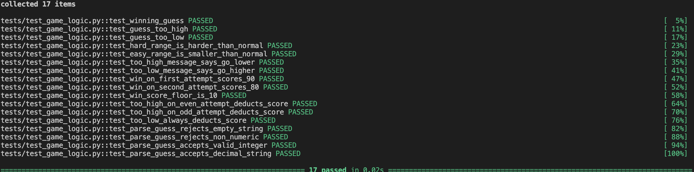
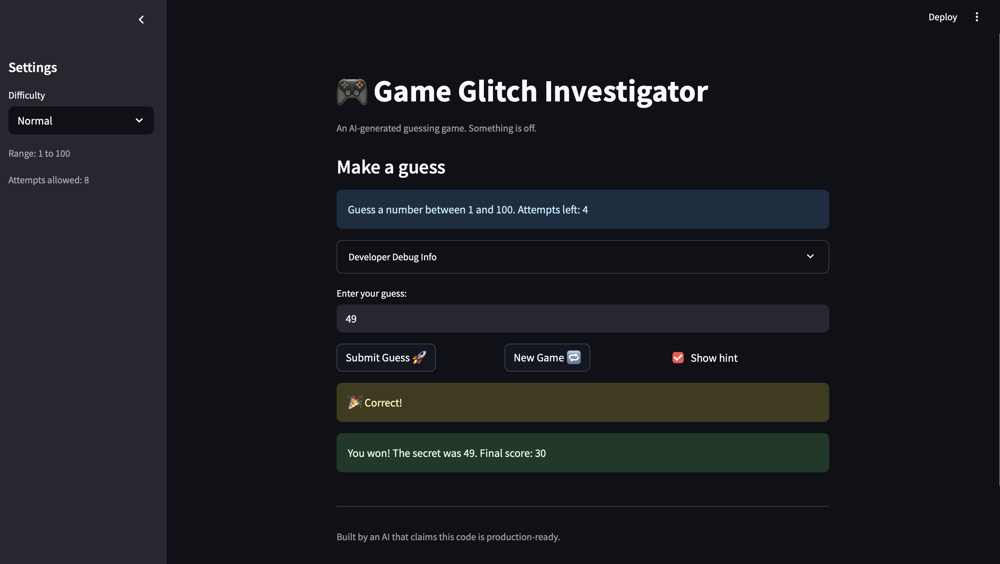

# 🎮 Game Glitch Investigator: The Impossible Guesser

## 🚨 The Situation

You asked an AI to build a simple "Number Guessing Game" using Streamlit.
It wrote the code, ran away, and now the game is unplayable. 

- You can't win.
- The hints lie to you.
- The secret number seems to have commitment issues.

## 🛠️ Setup

1. Install dependencies: `pip install -r requirements.txt`
2. Run the broken app: `python -m streamlit run app.py`

## 🕵️‍♂️ Your Mission

1. **Play the game.** Open the "Developer Debug Info" tab in the app to see the secret number. Try to win.
2. **Find the State Bug.** Why does the secret number change every time you click "Submit"? Ask ChatGPT: *"How do I keep a variable from resetting in Streamlit when I click a button?"*
3. **Fix the Logic.** The hints ("Higher/Lower") are wrong. Fix them.
4. **Refactor & Test.** - Move the logic into `logic_utils.py`.
   - Run `pytest` in your terminal.
   - Keep fixing until all tests pass!

## 📝 Document Your Experience

**Game purpose:** Glitchy Guesser is a number-guessing game where the player tries to guess a secret number within a limited number of attempts. The difficulty setting controls the range (Easy: 1–20, Normal: 1–100, Hard: 1–200) and the number of allowed attempts. Correct guesses score points; wrong guesses deduct points, with the bonus decreasing the more attempts it takes to win.

**Bugs found:**

| # | Location | Bug |
|---|----------|-----|
| 1 | `app.py` | `st.session_state.attempts` initialized to `1` instead of `0` — first load showed one attempt already used |
| 2 | `app.py` | Info bar range hardcoded to `"1 and 100"` regardless of selected difficulty |
| 3 | `app.py` | `st.session_state.attempts` incremented before input was validated — invalid guesses wasted a turn |
| 4 | `app.py` | On even-numbered attempts, the secret was cast to a `str`, making every even comparison fail silently |
| 5 | `app.py` | "New Game" did not reset `status`, so a finished game stayed locked even after clicking the button |
| 6 | `app.py` | "New Game" used `random.randint(1, 100)` instead of the difficulty-based `low`/`high` range |
| 7 | `logic_utils.py` | Hard difficulty range was `1–50` — easier than Normal's `1–100` |
| 8 | `logic_utils.py` | `check_guess` hint messages were swapped: "Too High" said "Go HIGHER!" and vice versa |
| 9 | `logic_utils.py` | `update_score` used `attempt_number + 1`, over-penalizing every win by one extra attempt |
| 10 | `logic_utils.py` | `update_score` awarded `+5` points on even-numbered wrong guesses instead of always deducting 5 |

**Fixes applied:**

- Moved all game logic (`get_range_for_difficulty`, `parse_guess`, `check_guess`, `update_score`) out of `app.py` and into `logic_utils.py` so it could be unit-tested with pytest.
- Fixed Hard difficulty range to `1–200` in `get_range_for_difficulty`.
- Corrected the swapped hint messages in `check_guess` (`Too High` → "Go LOWER!", `Too Low` → "Go HIGHER!").
- Removed the `attempt_number + 1` off-by-one from `update_score` win formula.
- Replaced the even/odd `+5` scoring branch with a consistent `−5` deduction for all wrong guesses.
- Fixed `attempts` initialization to `0` and moved the increment inside the valid-parse branch.
- Removed the even-attempt string-cast sabotage from the submit handler.
- Made the info bar range and New Game reset use the dynamic `low`/`high` variables.
- Added `status = "playing"` to the New Game reset so finished games can restart.

## 📸 Demo

## 🚀 Stretch Features

- [ ] [If you choose to complete Challenge 4, insert a screenshot of your Enhanced Game UI here]
